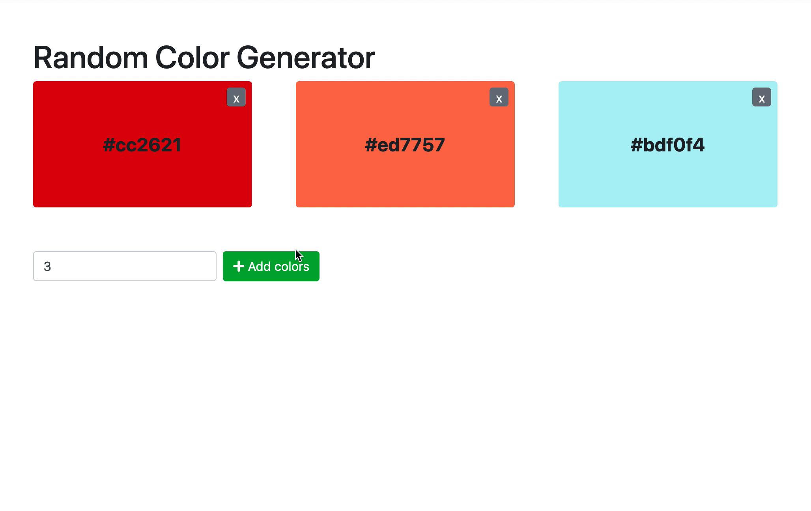

## Instructions for students:

### Random Color Generator

Create a color generator webpage. The page should generate a certain number of random color. 
 1. Create a function to generate a random color HEX code
 2. Create a function to add a new color item to the list, passing the color code as argument
 3. Test that function by calling it with a random color.
 4. Create a function to handle the removing of an item, passing the event as argument.
 5. Register the event handler to catch the event and attach the handler (4.).
 6. Test the removal by clicking on existing color items.
 7. Create a function to handle the submit of the form for adding more colors, which generates the needed amount of random hex colors and adds them to the list.
 8. Register the submit event and attach the handler (7.)
 9. Create a function init() that is called on load and generates 3 color elements

  
 

Example once your program is running properly:

 
 

### Rules

-   This is an individual assignment.
-   Deadline: 2 hours.

